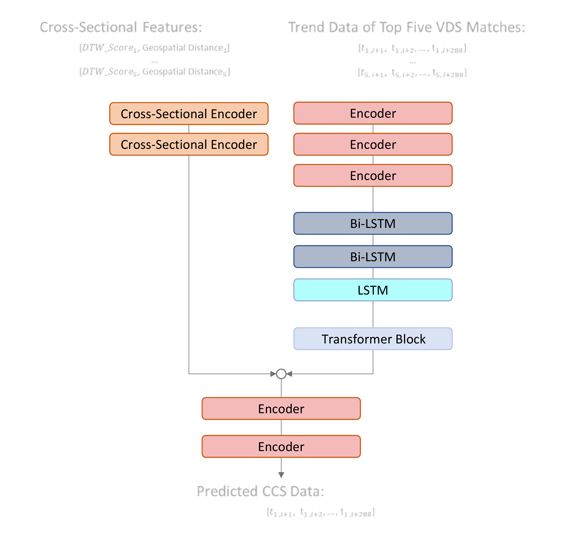

## 1. BackGround
___
This study aims to combine data from Georgia Department of Transportation's Continuous Count Stations (CCS) and Video Detection System (VDS) stations. CCS are sparsely located and provide statewide vehicle count and classification data. VDS stations are more densely deployed for monitoring traffic and providing real-time information. By matching VDS stations to CCS sites, a deep learning model called Contextual Informed Multi-Sequence to Single-Sequence (CIMS2SS) is created to generate or estimate CCS data from VDS data. The model uses spatiotemporal contextual information, historical median trends, and spatial distances of VDS stations to predict traffic volume at CCS sites. This can be used for quality control, generating data from VDS where CCS sites are absent, or substituting CCS data when stations are inactive or under maintenance.

<br><br>
## 1. Methodology
___
#### 1.1 CIMS2SS Architecture and Results
Our approach aimed to improve traffic prediction by incorporating spatiotemporal context. We selected the top five Video Detection System (VDS) locations that matched a target Continuous Count Station (CCS) location the best, and used the corresponding VDS volume trends along with their contextual features, such as Scale-Invariant Dynamic Time Warping (SI-DTW) score and geospatial distance, to predict CCS volumes. To achieve this, we extended the Contextual Informed Multi-Sequence to Single-Sequence (CIMS2SS) architecture with a parallel branch to inject spatiotemporal contextual information, as illustrated below."



A total of 72 CCS sites , each was paired with five matched VDS stations, are utilized for model training and testing.  To avoid information leak and ensure fair assessment, 10 CCS sites together with their VDS matches (50 VDS stations) are reserved for model testing. The remaining sites were then segmented into 24-hour windows and split into a training set (80%) and a validation set (20%). As shown in the table below, the CIMS2SS model obtains a test MAE of 5.3%, outperforming the single-station CLT model presented previously. The performance improvement is largely attributed to the addition of the spatiotemporal contextual features, leading to better generalization.  

|     Performance   Metric    |     Train    |     Validation     |     Test    |
|-----------------------------|--------------|--------------------|-------------|
|     MAE (%)                 |     3.5%     |     4.2%           |     5.3%    |

<br>

#### 1.2 UI Demo for Exploring Site Matches Based on Scale-Invariant Dynamic Time Warping (DTW) Methodology


##### Icon Format:
<p class="CCS Holdout"> CCS locations that have preloaded sample data.</p>
<p class="CCS Holdout"> CCS locations without preloaded sample data.</p>
<p class="CCS Holdout"> VDS locations</p>

<br><br>
## 2. Installation Guide
___
The installation steps outlined below assume that you have already installed the Anaconda package manager on your device.
#### Step 1: Set Directory
To navigate to the directory where the app is located, you can use the "cd" command in your terminal or command prompt. Here's an example command:
```commandline
cd /path/to/app/directory/RP2010_application
```
#### Step 2: Create Environment with Conda
```commandline
conda create --name RP2010app --file requirements.txt
conda activate RP2010app
```
#### Step 3: Run Application
```commandline
streamlit run app.py
```
